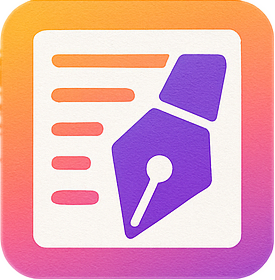

<div align="center">
  
</div>

<div align="center">

# VitePress Theme Open17

**让你的博客焕然一新 | 简洁 · 优雅 · 强大**

<a href="https://www.npmjs.com/package/vitepress-theme-open17" target="_blank">
  
</a>
<a href="https://github.com/open17/vitepress-theme-open17/" target="_blank">
  
</a>
<a href="https://github.com/open17/vitepress-theme-open17/blob/template/LICENSE" target="_blank">
  
</a>
<br>
<a href="https://vitepress.open17.vip/guide/0-intro/">📚 文档</a> · 
<a href="https://vitepress.open17.vip/page/blog.html">🚀 演示</a> 
</div>

---

## ✨ 为什么选择 Open17？

> **无缝沿用 VitePress 默认配置，轻松构建你的个性化博客**

Open17 是一款专为 VitePress 设计的现代化博客主题，在保持原有强大功能的基础上，为你带来全新的博客体验。

## ⚡ 一键开始

自动安装+配置主题,一行即可!

```bash
# my-blog换为你的项目名
npm create open17-blog my-blog
```

## 🌟 丰富功能一览

<table>
<tr>
<td width="50%">

**🏡 博客核心**
- ✅ 博客主页布局
- ✅ 文章列表分页
- ✅ 摘要自动提取
- ✅ 文章置顶功能
- ✅ 个人资料卡

</td>
<td width="50%">

**🏷️ 组织管理**
- ✅ 标签系统
- ✅ 分类管理
- ✅ 归档统计
- ✅ 全文搜索
- ✅ RSS 订阅源

</td>
</tr>
<tr>
<td>

**🎨 个性定制**
- ✅ 自定义配色
- ✅ 自定义背景
- ✅ 明暗模式切换
- ✅ TailwindCSS
- ✅ 自定义组件

</td>
<td>

**💬 交互体验**
- ✅ 评论系统集成
- ✅ 响应式设计
- ✅ SEO 优化
- ✅ Markdown 增强
- ✅ 默认主题兼容

</td>
</tr>
</table>

</div>

## 📸 主题预览

<div align="center">
  
**现代化设计 · 优雅的阅读体验**

[🎯 查看在线演示](https://vitepress.open17.vip/page/blog.html)

</div>

## 其他配置方式

> 更推荐使用一键开始命令

### 方式：github模板

使用 GitHub Template 快速创建你的博客：

<div align="center">

[点击一键创建📦](https://github.com/open17/vitepress-theme-open17/generate)

</div>

### 方式：手动安装

```bash
npm install -D vitepress-theme-open17
```

然后在 VitePress 主题入口中启用主题:
```js
// .vitepress/theme/index.js
import Theme from 'vitepress-theme-open17'
export default Theme
```

使用类型安全的方式编写配置:
```ts
// .vitepress/config.ts
import type { ThemeConfig } from 'vitepress-theme-open17/config'
import { defineConfigWithTheme } from 'vitepress'

export default defineConfigWithTheme<ThemeConfig>({
  themeConfig: {
    // 你的主题配置
  }
})
```


## 📚 完整指南

- 📖 [快速开始](https://vitepress.open17.vip/guide/0-intro/0-start.html) - 5分钟上手指南
- ⚙️ [主题配置](https://vitepress.open17.vip/guide/1-config/) - 详细配置说明
- 🎨 [样式定制](https://vitepress.open17.vip/guide/1-config/2-style.html) - 打造专属风格
- 🔧 [进阶使用](https://vitepress.open17.vip/guide/2-more/) - 高级功能探索

## 💝 社区支持

<div align="center">

**如果这个主题对你有帮助，请给我们一个 ⭐**

**你的支持是我们持续更新的最佳动力！**

[🐛反馈问题](https://github.com/open17/vitepress-theme-open17/issues)
[💡功能建议](https://github.com/open17/vitepress-theme-open17/discussions)

</div>


---

<div align="center">

**Made with ❤️ by [open17](https://github.com/open17)**

</div>